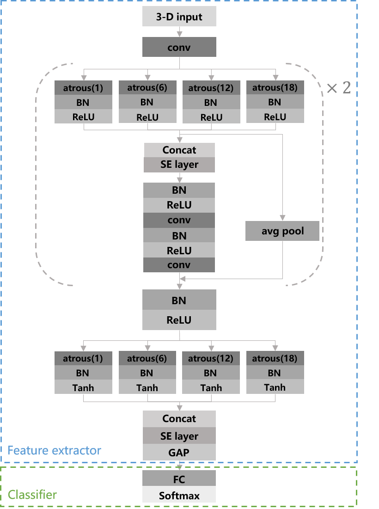
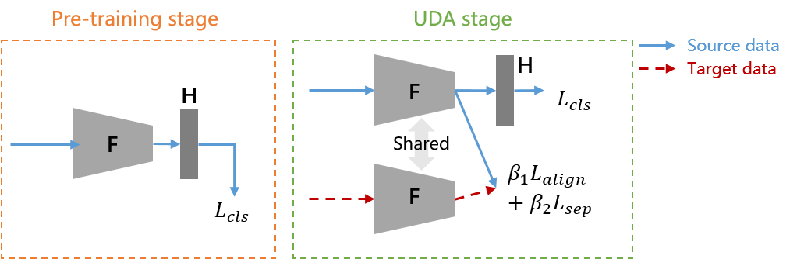
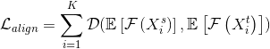
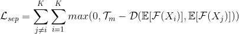
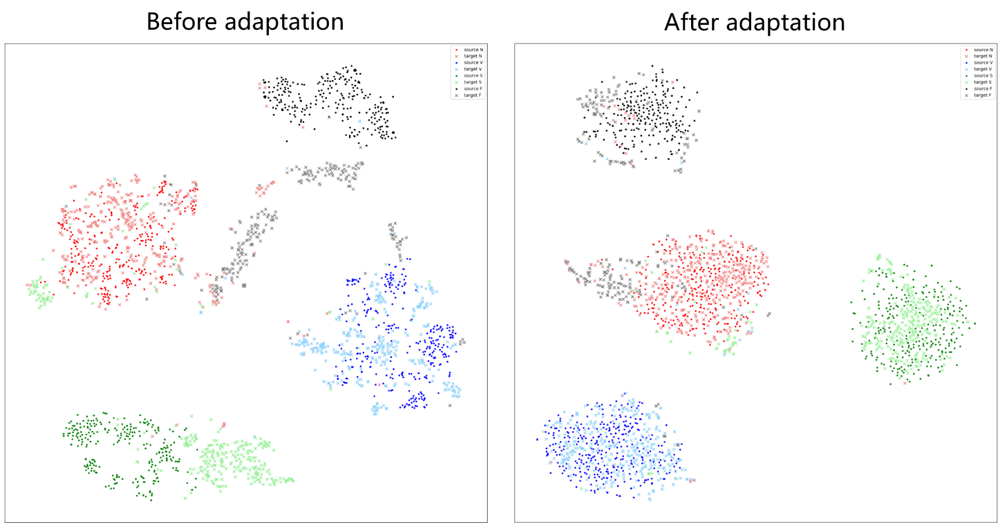

# ECG_UDA

PyTorch implementation for a statistics-based unsupervised domain adaptation algorithm of ECG heartbeat classification.

-------------------
## MACN

We proposed a baseline model called <u>M</u>ulti-path <u>A</u>trous <u>C</u>onvolutional <u>N</u>etwork (MACN) for NSVF heartbeat classification. The MACN can be viewed as two components, a feature extractor F and a classifier H. The atrous spatial pyramid pooling (ASPP) module has four atrous convolutional layers with different dilation rates, which can extract feature representations of multiple scales. A squeeze-and-excitation layer is used to automatically select the most contributory feature channels.

------------------
## Domain Adaptation

We introduce two loss function to fulfill unsupervised domain adaptation.
* Cluster-Aligning Loss

* Cluster-Separating Loss

------------------
## Experiments and Results

We evaluate the model on MIT-BIH Arrhythmia Database. We provide both numerical results and some visualization results.

| Methods | Se(N) | +P(N) | F1(N) | Se(V) | +P(V) | F1(V) | Se(S) | +P(S) | F1(S) | Se(F) | +P(F) | F1(F) | Overall accuracy |
| ---- | ---- | ---- | ---- | ---- | ---- | ---- | ---- | ---- | ---- | ---- | ---- | ---- | ---- |
| MACN | 95.23% | 97.90% | 0.96 | 90.67% | 85.51% | 0.88 | 64.38% | 66.30% | 0.65 | 35.56% | 9.56% | 0.15 | 93.33% |
| MACN+UDA | 95.34% | 98.46% | 0.97 | 95.77% | 93.89% | 0.95 | 78.59% | 88.67% | 0.83 | 43.81% | 8.83% | 0.15 | 94.35% |

